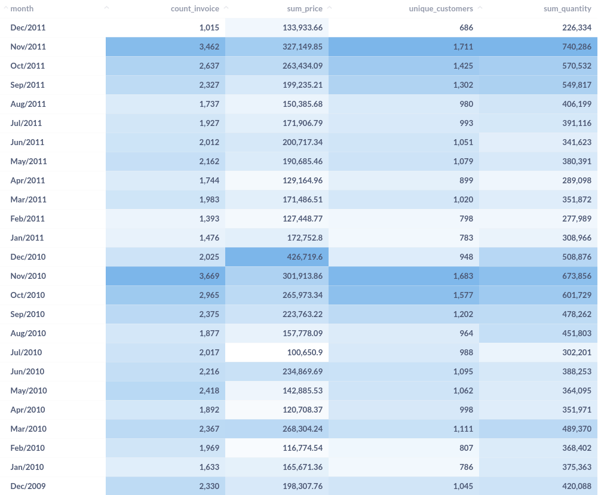
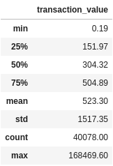
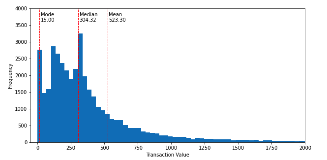
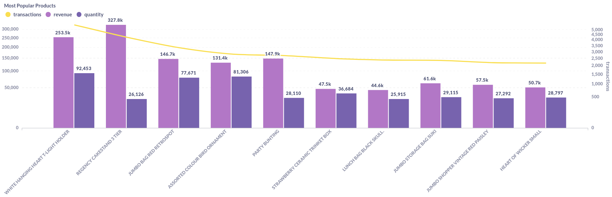

# Analytics Test - Online Retail

#### [Overview](#verview)
  - [Technologies used to deploy and share the analysis](#technologies-used-to-deploy-and-share-the-analysis)
#### [Understanding the Data](#understanding-the-data)
  - [What are the dimensions of the dataset?](#what-are-the-dimensions-of-the-dataset)
  - [Are there any missing values?](#are-there-any-nullmissing-values)
  - [What attributes and data types it contains?](#what-are-the-attributes-columns-and-which-data-types-they-hold)
#### [Understanding the Context](#understanding-the-context)
  - [How many unique values?](#how-many-unique-values)
  - [What time window are we looking at?](#what-time-window-are-we-looking-at)
  - [How many different customers have bought a product from the company?](#how-many-different-customers-have-bought-a-product-from-the-company)
  - [Which day had the most transactions happening?](#which-day-had-the-most-transactions-happening)
  - [What is the average value of a transaction?](#what-is-the-average-value-of-a-transaction)
  - [Which products are most popular?](#which-products-are-most-popular)
  - [Are there any relevant outliers?](#are-there-any-relevant-outliers)
  - [What is the range of prices?](#what-is-the-range-of-prices)
  - [How many products per invoice?](#how-many-products-per-invoice)
  - [How many customers per country?](#how-many-customers-per-country)
  - [Closing Remarks](#closing-remarks)
#### [Dashboard Queries](#dashboard-queries)

<br/><br/>

## Overview

This document describes my process for the Exploratory Data Analysis (EDA) of the `online_retail_II` dataset.

`TLDR`: The present document contains a more throughout description of the process, queries and reasoning i use as starting point for most analysis.

If you are a visual learner or not so much into the "*tech-side*" of data, there is a dashboard with filters for you to play around and come up with some new insights!<br/>

You can access the dashboard here:
**[Online Retail - Dashboard](http://dash-analytics-test.herokuapp.com/public/dashboard/a5fda97e-9061-499e-9ad3-36559a67e8d4)**
<br/><br/>

#### Technologies used to deploy and share the analysis

##### Database
-  AWS RDS Postgres instance<br/>
> (for more information: https://aws.amazon.com/rds/postgresql/)

##### Dashboard:
- Metabase on Heroku<br/>
> (for more information: https://www.metabase.com/docs/latest/operations-guide/running-metabase-on-heroku.html)

<br/>

## Understanding the Data
#### What are the dimensions of the dataset?
```sql
SELECT
    'online_retail' AS table,
    (
        SELECT COUNT(*)
        FROM online_retail

    ) as rows,
    (
        SELECT COUNT(*)
        FROM information_schema.columns
        WHERE table_name = 'online_retail'

    ) as columns
```

table        |rows     |columns
:-----------:|:-------:|:-----:
online_retail|1,067,371|8

The dataset has **8 columns** and around **1 million rows**. Let's see what else we can find...

<br/><br/>

#### Are there any null/missing values?
```sql
SELECT
SELECT 'invoice'     AS column_name, SUM(case when invoice     is NULL then 1 else 0 end) AS null_values FROM online_retail
UNION
SELECT 'stockcode'   AS column_name, SUM(case when stockcode   is NULL then 1 else 0 end) AS null_values FROM online_retail
UNION
select 'description' AS column_name, SUM(case when description is NULL then 1 else 0 end) AS null_values FROM online_retail
UNION
SELECT 'quantity'    AS column_name, SUM(case when quantity    is NULL then 1 else 0 end) AS null_values FROM online_retail
UNION
SELECT 'invoicedate' AS column_name, SUM(case when invoicedate is NULL then 1 else 0 end) AS null_values FROM online_retail
UNION
SELECT 'price'       AS column_name, SUM(case when price       is NULL then 1 else 0 end) AS null_values FROM online_retail
UNION
SELECT 'customer_id' AS column_name, SUM(case when customer_id is NULL then 1 else 0 end) AS null_values FROM online_retail
UNION
SELECT 'country'     AS column_name, SUM(case when country     is NULL then 1 else 0 end) AS null_values FROM online_retail
ORDER BY null_values DESC
FROM online_retail
```
column_name|null_values
:---------:|:---------:
customer_id|243007
description|4382
invoice    |0
stockcode  |0
invoicedate|0
price      |0
quantity   |0
country    |0

About a 1/4 of the values are missing from our `customer_id` column.

Although that may be very relevant because it represents a large fraction of the data and it looks like the main way to identify an unique customer, we still have plenty to work with and to maybe make some assumptions about why is this data missing or what other ways we can identify a customer.

<br/><br/>

#### What are the attributes (columns) and which data types they hold?
```sql
SELECT
    column_name,
    data_type
FROM information_schema.columns
WHERE table_name = 'online_retail'
```

column_name|data_type
:---------:|:--------------------------:
invoice    |character varying
stockcode  |character varying
description|character varying
quantity   |bigint
invoicedate|timestamp without time zone
price      |double precision
customer_id|double precision
country	   |character varying

From a quick look at this we can say that this data is about orders made by customers.

  - Products:
    - `stockcode`: Categorical / Serial. It seems to be the unique ID of a product.
    - `price`: Quantitative. Assuming its the unitary price of a product.
    - `description`: Categorical. Description of the product.

  - Customers:
    - `customer_id`: Serial. Unique ID of a customer.
    - `country`: Categorical. Assuming it's the country of origin for an invoice/customer.

  - Orders:
    - `invoice`: Serial. Unique ID of each order. A single order can have multiple products.
    - `invoicedate`: Timestamp. Assuming it's in UTC-0 because most of the customers are from the UK.
    - `quantity`: Quantitative. Number of unities ordered for a product.

<br/><br/>

## Understanding the Context

Now that we know more about what data and how much of it we have, it's time to ask some more questions to get a sense of context.
We want to use our data to answer some basic **_who_**, **_when_**, **_where_**, **_what_** and **_how many/much_** questions.

<br/><br/>

#### How many unique values?
```sql
SELECT 'invoice'     AS column_name, COUNT(DISTINCT invoice)     AS n_unique FROM online_retail
UNION
SELECT 'stockcode'   AS column_name, COUNT(DISTINCT stockcode)   AS n_unique FROM online_retail
UNION
SELECT 'description' AS column_name, COUNT(DISTINCT description) AS n_unique FROM online_retail
UNION
SELECT 'quantity'    AS column_name, COUNT(DISTINCT quantity)    AS n_unique FROM online_retail
UNION
SELECT 'invoicedate' AS column_name, COUNT(DISTINCT invoicedate) AS n_unique FROM online_retail
UNION
SELECT 'price'       AS column_name, COUNT(DISTINCT price)       AS n_unique FROM online_retail
UNION
SELECT 'customer_id' AS column_name, COUNT(DISTINCT customer_id) AS n_unique FROM online_retail
UNION
SELECT 'country'     AS column_name, COUNT(DISTINCT country)     AS n_unique FROM online_retail
ORDER BY n_unique DESC

```
column_name|unique_values
:---------:|:-----------:
invoice    |53628
invoicedate|47635
customer_id|5942
description|5698
stockcode  |5305
price      |2807
quantity   |1057
country    |43

Let's now see what time window is covered by our data

```sql
    SELECT
        TO_CHAR(DATE_TRUNC('mon', invoicedate),'Mon/YYYY') AS month,
        COUNT(distinct invoice)                            AS count_invoice,
        sum(price)                                         AS sum_price,
        count(distinct customer_id)                        AS unique_customers,
        sum(quantity)                                      AS sum_quantity

    FROM online_retail
    GROUP BY month
    ORDER BY month DESC

```


Now we know that this dataset contains data from **53,628 invoices**, made by approximately **5942 different customers** from **43 countries** who bought more than **5 thousand unique products** in a **two year window** from december 2009 to december 2011.

<br/><br/>

#### How many different customers have bought a product from the company?
```sql
SELECT
    'customer_id' AS column_name,
    COUNT(DISTINCT customer_id) AS n_unique
FROM online_retail
```
column_name|unique_values
:---------:|:-----------:
customer_id|5942

 _(*note that the real number of unique customer may actually be higher, since nearly 1/4 of all customer_id contain null values*)_

We can take this one step further and get the 5 coutries with most customers.

```sql
SELECT
    country,
    COUNT(DISTINCT customer_id) AS n_unique
FROM online_retail
GROUP BY 1
ORDER BY 2 DESC
LIMIT 5
```
country       |unique_customers
:------------:|:--------------:
United Kingdom|5410
Germany       |107
France        |95
Spain         |41
Belgium       |29

Most of the customers are from UK, followed by a few neighbouring countries, this might suggest that this data is from an English online retailer that sells mostly within Europe.

<br/><br/>

#### Which day had the most transactions happening?

```sql
SELECT
    CAST(date_trunc('d',invoicedate) AS DATE) AS day,
    COUNT(distinct invoice) AS daily_transactions
FROM online_retail
GROUP BY day
ORDER BY daily_transactions DESC
LIMIT 1
```
day        |transaction_count
:---------:|:---------------:
2010-11-04 |219

The day with most transaction was november the 4th, 2010 with 219 unique transactions.<br/>
Let's se the top 10, it's the same query so we just have to increase the limit of returning rows.

```sql
...
LIMIT 10
```
day       |daily_transactions
:--------:|:---------------:
2010-11-04|219
2011-10-06|218
2010-10-05|206
2009-12-22|203
2010-11-11|192
2010-11-24|188
2011-11-10|184
2010-12-09|183
2010-11-25|181
2010-05-11|180

Looks like the peak in transaction volume happens by the end of the year, likely due to holliday season.
What about on a weekly basis?

```sql
SELECT
    CAST(date_trunc('week',invoicedate) AS DATE) AS week,
    COUNT(distinct invoice) AS weekly_transactions
FROM online_retail
GROUP BY week
ORDER BY weekly_transactions DESC
LIMIT 10
```
week      |weekly_transactions
:--------:|:-----------------:
2011-11-14|894
2010-11-01|891
2010-11-22|854
2010-11-08|834
2011-11-28|824
2010-11-29|808
2010-11-15|795
2011-11-07|781
2011-11-21|754
2010-10-18|750

Seems like november is the best month for sales.

<br/><br/>

#### What is the average value of a transaction?

Considering the transaction value as the sum of prices times the quantity ordered for any single invoice.<br/>
_(obs: there are a few prices with negative value and a description of "adjusted bad debit", so we are going to disconsider all negative prices)_

The average reduces a series of numbers into a single number, while it's useful, alone it can lead to misinterpretations. So as to avoid this common pitfall, let's see how are the transaction values distributed along the price range.

```sql
with a as (

    SELECT
        invoice,
        sum(price * quantity)                          AS transaction_value
    FROM online_retail
    WHERE price > 0 and quantity > 0
    GROUP BY 1
    ORDER BY 2 asc

), b as (

    SELECT
        *,
        ntile(4) OVER (ORDER BY transaction_value ASC) AS quartile
    FROM a
)

SELECT
    'First Quartile'                                   AS measure,
    max(transaction_value)                             AS value
    from b
    where quartile = 1
UNION
SELECT
    'Mode'                                             AS measure,
    mode() WITHIN GROUP (ORDER BY transaction_value)   AS value
   FROM b
UNION
SELECT
    'Median'                                           AS measure,
    max(transaction_value)                             AS value
    FROM b
    WHERE quartile = 2
UNION
SELECT
    'Third Quartile'                                   AS measure,
    max(transaction_value)                             AS value
    FROM b
    WHERE quartile = 3
UNION
SELECT
    'Min'                                              AS measure,
    round(min(transaction_value)::numeric,2)           AS value
    FROM b
UNION
SELECT
    'Avg'                                              AS measure,
    round(avg(transaction_value)::numeric,2)           AS value
    FROM b
UNION
SELECT
    'StdDev'                                           AS measure,
    round(stddev_samp(transaction_value)::numeric,2)   AS value
    FROM b
UNION
SELECT
    'Max'                                              AS measure,
    round(max(transaction_value)::numeric,2)           AS value
    FROM b
ORDER BY value ASC
```
measure       |value
:------------:|:-------:
Min           |0.19
Mode          |15.00
First Quartile|151.97
Median        |304.32
Third Quartile|504.90
Avg           |523.30
StdDev        |1517.35
Max           |168469.60

<br/>

> While SQL can do most of the work it can get quite verbose. Using the python library pandas we can obtain the same results with much less typing!
> ```python
> import pandas as pd
> sql = """
>   SELECT
>        distinct invoice,
>        sum(price * quantity) as transaction_amount
>    FROM online_retail
>    where price > 0 AND quantity > 0
>    GROUP BY 1
>    ORDER BY 2 asc
> """
>
> df = pd.read_sql(sql, db.engine)
> r = df.describe()
> r.sort_values('transaction_amount').round(2)
> ```
> 
>

This tell us that **while the average transaction is just over $500.00, half are under $300.00 and the most common value for a transaction is as low as $15.00**.<br/>

The standard deviation is roughly 3 times the average, while the maximum price more than $160k, which indicates a large deviation probably due to some large outliers.

In other words, **when we ask about averages, we are often looking for a *"center of balance"*** in those numbers. One way to get a feel of this center, is by looking at the *skewness* of the data, or how *unbalanced* it is.

With this in mind we know there is a high concentration of transactions with lower values that decreases fast towards higher values.

let's plot this with some python:

```python
import pandas as pd

sql = """

    SELECT
        invoice,
        sum(price * quantity) AS transaction
    FROM online_retail
    WHERE price > 0 and quantity > 0
    GROUP BY 1
    ORDER BY 2 asc

"""
df = pd.read_sql(sql, engine)

mean = df.mean()['transaction']
median = df.median()['transaction']
mode = df.mode()['transaction'].iloc[0]

# plotting the frequency histogram
plt.figure(figsize=(10,5))

plt.ylim(0,4000)
plt.xlim(-50,2000)

plt.ylabel('Frequency')
plt.xlabel('Transaction Amount')
plt.hist(x=df['transaction'], bins=5000)

plt.axvline(mean, color='r', linestyle='dashed', linewidth=1)
plt.text(mean + 10, 3600, f'Mean\n{mean:.2f}')

plt.axvline(median, color='r', linestyle='dashed', linewidth=1)
plt.text(median + 10, 3600, f'Median\n{median:.2f}')

plt.axvline(mode, color='r', linestyle='dashed', linewidth=1)
plt.text(mode + 10, 3600, f'Mode\n{mode:.2f}')
```


With a quick glance at this histogram we can say that the average is 523, but most of the prices are between ~50 and ~300.

<br/><br/>

#### Which products are most popular?

What are we going to consider as popular?<br/>

- **By number of transactions:**

```sql
SELECT
    stockcode,
    description,
    COUNT(distinct invoice) AS transactions
FROM online_retail
GROUP BY 1, 2
ORDER BY 3 DESC
LIMIT 10
```
stockcode|description                       |transactions
:-------:|:--------------------------------:|:----------:
85123A   |WHITE HANGING HEART T-LIGHT HOLDER|5495
22423    |REGENCY CAKESTAND 3 TIER          |4261
85099B   |JUMBO BAG RED RETROSPOT           |3320
84879    |ASSORTED COLOUR BIRD ORNAMENT     |2827
47566    |PARTY BUNTING                     |2699
21232    |STRAWBERRY CERAMIC TRINKET BOX    |2488
20727    |LUNCH BAG  BLACK SKULL.           |2396
21931    |JUMBO STORAGE BAG SUKI            |2364
22411    |JUMBO SHOPPER VINTAGE RED PAISLEY |2215
22469    |HEART OF WICKER SMALL             |2174

- **By total quantity sold**

```sql
SELECT
    stockcode,
    description,
    sum(quantity) AS total_quantity
FROM online_retail
GROUP BY 1, 2
ORDER BY 3 DESC
LIMIT 10
```
stockcode|description                       |total_quantity
:-------:|:--------------------------------:|:------------:
84077    |WORLD WAR 2 GLIDERS ASSTD DESIGNS |108545
85123A   |WHITE HANGING HEART T-LIGHT HOLDER|92453
84879    |ASSORTED COLOUR BIRD ORNAMENT     |81306
85099B   |JUMBO BAG RED RETROSPOT           |77671
17003    |BROCADE RING PURSE                |70700
21977    |PACK OF 60 PINK PAISLEY CAKE CASES|56575
84991    |60 TEATIME FAIRY CAKE CASES       |54366
22197    |SMALL POPCORN HOLDER              |49616
21212    |PACK OF 72 RETROSPOT CAKE CASES   |49344
21212    |PACK OF 72 RETRO SPOT CAKE CASES  |46106

- **By revenue generated**
```sql
SELECT
    stockcode,
    description,
    round(sum(price * quantity)::numeric,2) AS revenue
FROM online_retail
GROUP BY 1, 2
ORDER BY 3 DESC
LIMIT 10
```
stockcode|description                        |revenue
:-------:|:---------------------------------:|:-------:
22423    |REGENCY CAKESTAND 3 TIER           |327813.65
DOT      |DOTCOM POSTAGE                     |322647.47
85123A   |WHITE HANGING HEART T-LIGHT HOLDER |253541.51
47566    |PARTY BUNTING                      |147948.50
85099B   |JUMBO BAG RED RETROSPOT            |46689.00
84879    |ASSORTED COLOUR BIRD ORNAMENT      |131413.85
22086    |PAPER CHAIN KIT 50'S CHRISTMAS     |121662.14
POST     |POSTAGE                            |112341.00
79321    |CHILLI LIGHTS                      |84854.16
84347    |ROTATING SILVER ANGELS T-LIGHT HLDR|73814.72

Now, lets try and plot all this information combined to see the performances for the top 10 products, this time with Metabase, our BI tool of choice.



Which products show in all three results?

```sql
WITH a as (

    SELECT
        stockcode,
        description,
        COUNT(distinct invoice) AS transactions
    FROM online_retail
    GROUP BY 1, 2
    ORDER BY 3 DESC
    LIMIT 10

), b as (

    SELECT
        stockcode,
        description,
        sum(quantity) AS quantity
    FROM online_retail
    GROUP BY 1, 2
    ORDER BY 3 DESC
    LIMIT 10

), c as (

    SELECT
        stockcode,
        description,
        round(sum(price * quantity)::numeric,2) AS revenue
    FROM online_retail
    GROUP BY 1, 2
    ORDER BY 3 DESC
    LIMIT 10

)

SELECT
    a.stockcode,
    a.description,
    a.transactions,
    b.quantity,
    c.revenue
FROM a
    INNER JOIN b ON a.stockcode = b.stockcode
    INNER JOIN c ON a.stockcode = c.stockcode
ORDER BY quantity DESC
```
stockcode|description                       |transactions  |quantity |revenue
:-------:|:--------------------------------:|:------------:|:-------:|:-----:
85123A   |WHITE HANGING HEART T-LIGHT HOLDER|5,495         |92,453   |253,541.51
84879    |ASSORTED COLOUR BIRD ORNAMENT     |2,827         |81,306   |131,413.85
85099B   |JUMBO BAG RED RETROSPOT           |3,320         |77,671   |146,689.00

Who would guess heart hanging light holders would be so popular?!


[Source](https://i.pinimg.com/originals/6f/a0/46/6fa04668fc88d6e40af7566694df0234.jpg)

And even if we filter by unique customers these hanging lights still outperform the other products, being ordered by 1.4k unique customers in more than 20 countries!

```sql
SELECT
	stockcode,
	description,
	count(DISTINCT customer_id) AS unique_customers,
	count(DISTINCT country)     AS unique_countries
FROM online_retail
GROUP BY 1, 2
ORDER BY 3 desc
LIMIT 5
```
stockcode|description                       |unique_customers|unique_countries
:-------:|:--------------------------------:|:--------------:|:--------------:
85123A   |WHITE HANGING HEART T-LIGHT HOLDER|1494            |23
22423    |REGENCY CAKESTAND 3 TIER          |1316            |31
22138    |BAKING SET 9 PIECE RETROSPOT      |1152            |31
84879    |ASSORTED COLOUR BIRD ORNAMENT     |1012            |19
22086    |PAPER CHAIN KIT 50'S CHRISTMAS    |896             |12

<br/><br/>

#### Additional notes and observations

**Negative quantities and prices**

While there is just one distinct stockcode and 5 rows where the price is negative, there are more than 4,000 distinct stockcode values where the quantity for that row is negative.

```sql
select
    distinct stockcode,
    invoice,
    quantity,
    price,
    description
from online_retail
where price < 0
order by 1
```
stockcode|invoice|quantity|price    |description
:-------:|:-----:|:------:|:-------:|:-------------:
B        |A506401|1       |-53594.36|Adjust bad debt
B        |A516228|1       |-44031.79|Adjust bad debt
B        |A528059|1       |-38925.87|Adjust bad debt
B        |A563186|1       |-11062.06|Adjust bad debt
B        |A563187|1       |-11062.06|Adjust bad debt


I've noticed most of the invoices starting with C hold negative quantities except for 1 row, but there are plenty other invoices with negative quantities, at first glance i couldn't see any specific identifier for these negative quantities. Perhaps it has to do with cancelled orders, or returning products.

The best way would be to understand where these stockcodes come from and how they are inputed to the system, but while that may not always be possible, a deeper exploration crossing prices, quantities and descriptions could expose some underlying relationships in the data.

**invoice**

<br/><br/>

#### Closing remarks

From here on we could continue our exploration, trying to understand all the meaningful relations between products, orders, customers and countries.

There is enough data here alone to learn many things and ask many questions, but like any creative endeavour, one must know when to stop and present what was found so far before, get feedback from peers and keep check with relevant stakeholders that relie on your analysis.

Data can tell us a lot, but data alone is note enought, Data Science/Analytics/Engineering is about learning, sharing, questioning and communicating. It's about translation, meaning and memory, about action and reaction.

**Good data analytics should feel intuitive and simple, despite how technically challenging it can be to achieve such results.**

<br/><br/>

## Dashboard Queries

