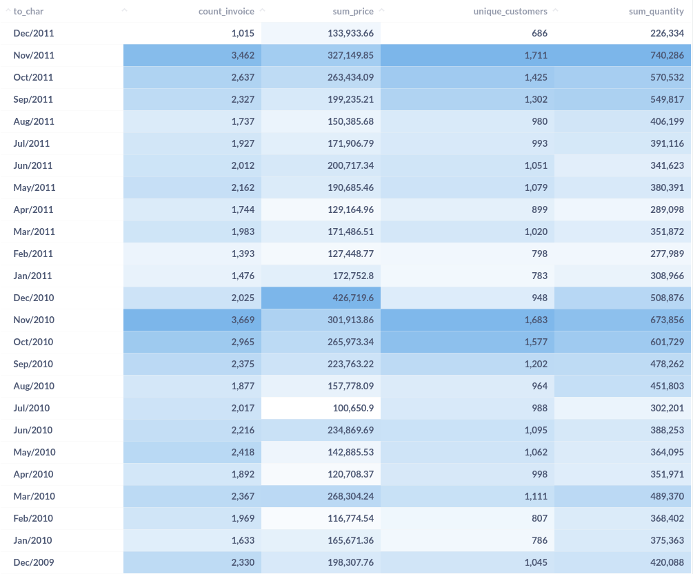

# Analytics Test - Online Retail

#### [Overview](#verview)
  - [Technologies used to deploy and share the analysis](#technologies-used-to-deploy-and-share-the-analysis)
#### [Understanding the Data](#understanding-the-data)
  - [What are the dimensions of the dataset?](#what-are-the-dimensions-of-the-dataset)
  - [Are there any missing values?](#are-there-any-nullmissing-values)
  - [What attributes and data types it contains?](#what-are-the-attributes-columns-and-which-data-types-they-hold)
#### [Understanding the Context](#understanding-the-context)
  - [How many unique values?](#how-many-unique-values)
  - [What time window are we looking at?](#what-time-window-are-we-looking-at)
  - [How many different customers have bought a product from the company?](#how-many-different-customers-have-bought-a-product-from-the-company)
  - [Which day had the most transactions happening?](#which-day-had-the-most-transactions-happening)
  - [What is the average value of a transaction?](#what-is-the-average-value-of-a-transaction)
  - [Which products are most popular?](#which-products-are-most-popular)
  - [Are there any relevant outliers?](#are-there-any-relevant-outliers)
  - [What is the range of prices?](#what-is-the-range-of-prices)
  - [How many products per invoice?](#how-many-products-per-invoice)
  - [How many customers per country?](#how-many-customers-per-country)

#### [Dashboard Queries]()

<br/><br/>

## Overview

This document describes my process for the Exploratory Data Analysis (EDA) of the `online_retail_II` dataset.

`TLDR`: The present document contains a more throughout description of the process, queries and reasoning i use as starting point for most analysis.

If you are a visual learner or not so much into the "*tech-side*" of data, there is a dashboard with filters for you to play around and come up with some new insights!<br/>

You can access the dashboard here:
**[Online Retail - Dashboard](http://dash-analytics-test.herokuapp.com/public/dashboard/a5fda97e-9061-499e-9ad3-36559a67e8d4)**
<br/><br/>

#### Technologies used to deploy and share the analysis

##### Database
-  AWS RDS Postgres instance<br/>
> (for more information: https://aws.amazon.com/rds/postgresql/)

##### Dashboard:
- Metabase on Heroku<br/>
> (for more information: https://www.metabase.com/docs/latest/operations-guide/running-metabase-on-heroku.html)

<br/>

## Understanding the Data
#### What are the dimensions of the dataset?
```sql
SELECT
    'online_retail' AS table,
    (
        SELECT COUNT(*)
        FROM online_retail

    ) as rows,
    (
        SELECT COUNT(*)
        FROM information_schema.columns
        WHERE table_name = 'online_retail'

    ) as columns
```

table        |rows     |columns
:-----------:|:-------:|:-----:
online_retail|1,067,371|8

The dataset has **8 columns** and around **1 million rows**. Let's see what else we can find...

<br/><br/>

#### Are there any null/missing values?
```sql
SELECT
SELECT 'invoice'     AS column_name, SUM(case when invoice     is NULL then 1 else 0 end) AS null_values FROM online_retail
UNION
SELECT 'stockcode'   AS column_name, SUM(case when stockcode   is NULL then 1 else 0 end) AS null_values FROM online_retail
UNION
select 'description' AS column_name, SUM(case when description is NULL then 1 else 0 end) AS null_values FROM online_retail
UNION
SELECT 'quantity'    AS column_name, SUM(case when quantity    is NULL then 1 else 0 end) AS null_values FROM online_retail
UNION
SELECT 'invoicedate' AS column_name, SUM(case when invoicedate is NULL then 1 else 0 end) AS null_values FROM online_retail
UNION
SELECT 'price'       AS column_name, SUM(case when price       is NULL then 1 else 0 end) AS null_values FROM online_retail
UNION
SELECT 'customer_id' AS column_name, SUM(case when customer_id is NULL then 1 else 0 end) AS null_values FROM online_retail
UNION
SELECT 'country'     AS column_name, SUM(case when country     is NULL then 1 else 0 end) AS null_values FROM online_retail
ORDER BY null_values DESC
FROM online_retail
```
column_name|null_values
:---------:|:---------:
customer_id|243007
description|4382
invoice    |0
stockcode  |0
invoicedate|0
price      |0
quantity   |0
country    |0

About a 1/4 of the values are missing from our `customer_id` column.

Although that may be very relevant because it represents a large fraction of the data and it looks like the main way to identify an unique customer, we still have plenty to work with and to maybe make some assumptions about why is this data missing or what other ways we can identify a customer.

<br/><br/>

#### What are the attributes (columns) and which data types they hold?
```sql
SELECT
    column_name,
    data_type
FROM information_schema.columns
WHERE table_name = 'online_retail'
```

column_name|data_type
:---------:|:--------------------------:
invoice    |character varying
stockcode  |character varying
description|character varying
quantity   |bigint
invoicedate|timestamp without time zone
price      |double precision
customer_id|double precision
country	   |character varying

From a quick look at this we can say that this data is about orders made by customers.

  - Products:
    - `stockcode`: Categorical / Serial. It seems to be the unique ID of a product.
    - `price`: Quantitative. Assuming its the price for that row's `quantity` value.
    - `description`: Categorical. Description of the product.

  - Customers:
    - `customer_id`: Serial. Unique ID of a customer.
    - `country`: Categorical. Assuming it's the country of origin for an invoice/customer.

  - Orders:
    - `invoice`: Serial. Unique ID of each order. A single order can have multiple products.
    - `invoicedate`: Timestamp. Assuming it's in UTC-0 because most of the customers are from the UK.
    - `quantity`: Quantitative. Number of items ordered for any given product on an invoice.

<br/><br/>

## Understanding the Context

Now that we know more about what data and how much of it we have, it's time to ask some more questions to get a sense of context.
We want to use our data to answer some basic **_who_**, **_when_**, **_where_**, **_what_** and **_how many/much_** questions.

<br/><br/>

#### How many unique values?
```sql
SELECT 'invoice'     AS column_name, COUNT(DISTINCT invoice)     AS n_unique FROM online_retail
UNION
SELECT 'stockcode'   AS column_name, COUNT(DISTINCT stockcode)   AS n_unique FROM online_retail
UNION
SELECT 'description' AS column_name, COUNT(DISTINCT description) AS n_unique FROM online_retail
UNION
SELECT 'quantity'    AS column_name, COUNT(DISTINCT quantity)    AS n_unique FROM online_retail
UNION
SELECT 'invoicedate' AS column_name, COUNT(DISTINCT invoicedate) AS n_unique FROM online_retail
UNION
SELECT 'price'       AS column_name, COUNT(DISTINCT price)       AS n_unique FROM online_retail
UNION
SELECT 'customer_id' AS column_name, COUNT(DISTINCT customer_id) AS n_unique FROM online_retail
UNION
SELECT 'country'     AS column_name, COUNT(DISTINCT country)     AS n_unique FROM online_retail
ORDER BY n_unique DESC

```
column_name|unique_values
:---------:|:-----------:
invoice    |53628
invoicedate|47635
customer_id|5942
description|5698
stockcode  |5305
price      |2807
quantity   |1057
country    |43

Let's now see what time window is covered by our data

```sql
    SELECT
        CAST(DATE_TRUNC('mon', invoicedate)AS DATE) AS month,
        COUNT(DISTINCT invoice)                     AS count_invoice,
        SUM(price)                                  AS sum_price,
        COUNT(DISTINCT customer_id)                 AS unique_customers,
        SUM(quantity)                               AS sum_quantity

    FROM online_retail
    GROUP BY month
    ORDER BY month DESC
```


Now we know that this dataset contains data from **53,628 invoices**, made by approximately **5942 different customers** from **43 countries** who bought more than **5 thousand unique products** in a **two year window** from december 2009 to december 2011.

<br/><br/>

#### How many different customers have bought a product from the company?
```sql
SELECT
    'customer_id' AS column_name,
    COUNT(DISTINCT customer_id) AS n_unique
FROM online_retail
```
column_name|unique_values
:---------:|:-----------:
customer_id|5942

 _(*note that maybe 1/4 of the total is not being considered because of the null values*)_

We can take this one step further by get this count for the 5 coutries with most customers

```sql
SELECT
    country,
    COUNT(DISTINCT customer_id) AS n_unique
FROM online_retail
GROUP BY 1
ORDER BY 2 DESC
LIMIT 5
```
country       |unique_customers
:------------:|:--------------:
United Kingdom|5410
Germany       |107
France        |95
Spain         |41
Belgium       |29

Most of the customers are from UK followed by a few neighbouring country, this might suggest that this data is from an English online retailer that sells mostly inside Europe.

<br/><br/>

#### Which day had the most transactions happening?

```sql
SELECT
	cast(date_trunc('d',invoicedate) AS DATE) AS day,
    COUNT(invoice) AS transaction_count
FROM online_retail
GROUP BY day
ORDER BY transaction_count DESC
LIMIT 1
```
day        |transaction_count
:---------:|:---------------:
2010-12-06|7756

The day with most transactions is the 6th of december of the year 2010.<br/>
Let's se the top 10, it's the same query so we just have to increase the limit of returning rows.

```sql
...
LIMIT 10
```
day        |transaction_count
:---------:|:---------------:
2010-12-06 |7756
2010-12-01 |6216
2010-12-07 |5926
2010-12-09 |5782
2010-12-05 |5450
2011-12-05 |5331
2010-12-08 |5294
2011-12-08 |4940
2010-12-03 |4404
2011-11-29 |4313

It seems december 2010 was a great month, with 7 out of the 10 days with most transactions!
Just for a sanity check, let's see if this is just a daily trend by taking the top transaction count on a weekly basis:

```sql
SELECT
    CAST(date_trunc('week', invoicedate) AS DATE) AS week,
    COUNT(invoice) AS transaction_count
FROM online_retail
GROUP BY week
ORDER BY transaction_count DESC
LIMIT 10
```
day        |transaction_count
:---------:|:---------------:
2010-12-06 |28967
2010-11-29 |26655
2011-11-14 |21112
2011-11-21 |19950
2011-11-07 |19267
2010-11-22 |19111
2011-11-28 |18916
2010-11-15 |18763
2010-11-08 |18476
2011-12-05 |17707

It seems even when grouping by weeks, december 2010 had a great week of sales. Also by looking at this we can see that most sales occur by the end of the year, likely because of the hollidays.

<br/><br/>

#### What is the average value of a transaction?

By transactions we are assuming the sum of prices for a single invoice.
_(obs: there are a few prices with negative value and a description os adjusted bad debit, so we are going to disconsider all negative prices)_

The average reduces a series of numbers into a single number, while it's useful, alone it can lead to misinterpretations. So as to avoid this common pitfall, let's see how are the transaction values distributed along the price range.

```sql
WITH a AS (

    SELECT
        invoice,
        sum(price)                             AS sum_price
    FROM online_retail
    WHERE price > 0
    GROUP BY 1
    ORDER BY 2 asc

), b as (

	SELECT
	    *,
        ntile(4) over (order by sum_price asc) AS quartile
	FROM a
)

select
    'first Quartile'                           AS measure,
    max(sum_price)                             AS value
    from b
    where quartile = 1
union
select
    'median'                                   AS measure,
    max(sum_price)                             AS value
    from b
    where quartile = 2
union
select
    'third quartile'                           AS measure,
    max(sum_price)                             AS value
    from b
    where quartile = 3
union
SELECT
	'Min'                                       AS measure,
	round(min(sum_price)::numeric,2)            AS value
	FROM b
union
SELECT
    'Avg'                                       AS measure,
    round(avg(sum_price)::numeric,2)            AS value
	FROM b
union
SELECT
    'StdDev'                                    AS measure,
    round(stddev_samp(sum_price)::numeric,2)    AS value
	FROM b
union
SELECT
    'Max'                                       AS measure,
    round(max(sum_price)::numeric,2)            AS value
	FROM b
order by value asc
```
measure       |value
:------------:|:-------:
Min	          |0.01
first Quartile|11.30
median        |37.35
third quartile|83.47
Avg	          |105.88
StdDev        |532.73
Max           |38970.00

This tell us that while the average price is just over $100.00, 75% of the prices are under $83.00 .<br/>
The standard deviation is roughly 5 times the average, while the maximum price is nearly at $40,000.00, which indicates a large deviation probably caused by some outliers.

> while SQL can do most of the work, the python library Pandas can do it with less typing:
> ```python
> import pandas as pd
> sql = """
>   SELECT
>        distinct invoice,
>        sum(price) as invoice_amount
>    FROM online_retail
>    where price > 0
>    GROUP BY 1
>    ORDER BY 2 asc
>
> """
>
> df = pd.read_sql(sql, engine)
> r = df.describe()
> r.sort_values('invoice_amount').round(2)
> ```


<br/><br/>

#### Which products are most popular?

```sql
SELECT
    stockcode,
    description,
    COUNT(invoice) AS invoice_count
FROM online_retail
GROUP BY 1, 2
ORDER BY 3 DESC
LIMIT 10
```
stockcode|description                       |invoice_count
:-------:|:--------------------------------:|:-----------:
85123A   |WHITE HANGING HEART T-LIGHT HOLDER|5817
22423    |REGENCY CAKESTAND 3 TIER          |4412
85099B   |JUMBO BAG RED RETROSPOT           |3444
84879    |ASSORTED COLOUR BIRD ORNAMENT     |2958
47566    |PARTY BUNTING                     |2765
21232    |STRAWBERRY CERAMIC TRINKET BOX    |2613
20727    |LUNCH BAG  BLACK SKULL.           |2529
21931    |JUMBO STORAGE BAG SUKI            |2434
22469    |HEART OF WICKER SMALL             |2319
22411    |JUMBO SHOPPER VINTAGE RED PAISLEY |2297

<br/><br/>


#### Are there any relevant outliers?

<br/><br/>

#### What is the range of prices?

<br/><br/>

#### How many products per invoice?

<br/><br/>

#### How many customers per country?

